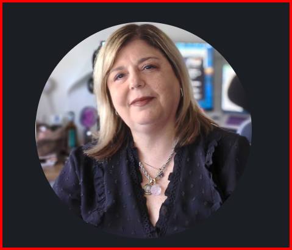

<table>
  <tr>
    <td width="150" valign="top">
      
    </td>
    <td valign="top" style="padding-left: 20px;">
      <h1>Hi, I'm Laura Saavedra 👋</h1>
      <h3>QA Senior Tech Lead | Business Analysis | Scrum Master</h3>
      
Senior QA Tech Lead and Business Analysis expert with 15+ years leading quality engineering, process improvement, and SDLC delivery for FinTech, Payment Gateways, EdTech, Pharma, Healthcare, Insurance, and Government organizations. Proven record in CCB governance, RCA, and ROI-driven process improvement.

    </td>
  </tr>
</table>

---

### 🚀 About Me
* **Quality Engineering:** Design and execute test strategies across Web, API, Mobile, and Performance domains. Lead shift-left testing, risk-based validation, and UAT coordination.
* **Business Analysis:** Requirements elicitation (JAD, workshops), BRD/SRS/URS/FRD authoring, RTM traceability, BPMN process mapping, and stakeholder management.
* **Leadership:** Led global and multicultural Onsite/Offshore teams (20+ members) across 10+ countries using Jira, GitHub, and Azure DevOps.

---

### 🛠 Tech Stack & Tools

* **QA & Testing:** Playwright, Selenium WebDriver, Cypress, Appium, Postman, REST Assured, JMeter, k6, Shift-Left Testing, Risk-Based Validation, Regression, Exploratory, Performance, Security, Accessibility, UAT Coordination, Test Strategy & Planning, Defect Lifecycle Management
* **Business Analysis:** BABOK Framework, BRD, SRS, URS, FRD, NFR, User Stories, Acceptance Criteria, RTM, BPMN, ERD, DFD, SWOT, Cost-Benefit Analysis, Business Case, ROI Measurement, Change Control (CCB), Root Cause Analysis (RCA), MoSCoW Prioritization, Process Improvement
* **Agile & Scrum:** Sprint Planning, Daily Standup, Sprint Review, Retrospective, Backlog Refinement, Story Points, Planning Poker, Velocity Tracking, Burndown Charts, Definition of Done (DoD), SAFe, Kanban, WIP Limits, SDLC
* **CI/CD & DevOps:** Jenkins, GitHub Actions, Docker, Azure DevOps, Quality Gates, CI/CD Pipelines
* **Tools:** Jira, Xray, Confluence, Coda, Azure DevOps, TestRail, Git, GitHub, MS Office Suite
* **AI & Innovation:** AI-Powered Test Generation, Self-Healing Automation, LLM Output Evaluation, AI Pilot POD, Prompt Engineering
* **Technical:** SQL, Oracle DB, Python, Strapi, REST APIs, Web Services, Linux, Data Modeling
* **Certifications:** ISTQB CTFL v4.0, Certified Mentor Trainer & Leader (PMBOK), Enterprise AI Solution, AI Coda Solution, Metodologias Agiles

---

### 💼 Work Experience

#### Sr Lead Level 2 QA/QC - AI Analyst & Technical Mentor | Globant | Aug 2021 - Apr 2026

* **AI Pilot POD - "Care A Pet" Web App (Jan-Apr 2026):** Facilitated JAD workshops with key stakeholders, eliciting and documenting 60+ requirements for an AI-powered web application. Authored user stories with BDD acceptance criteria (Given/When/Then) in Coda. Designed and executed automated test suites via Playwright, achieving 85% regression coverage.
* **Fiserv & IPG LATAM Payment Gateway (2023-2026):** Directed QA strategy across 10+ countries, coordinating global and multicultural Onsite/Offshore teams (20+ members). Participated in Change Control Board (CCB), evaluating 50+ scope changes and performing impact analysis. Coordinated UAT cycles, achieving a 95% test pass rate across 3 major releases. Reduced defect escape rate from 8% to 2% by implementing RCA practices. Maintained RTM linking 300+ requirements to test cases in Xray.
* **CeriFi, E-Learning (2022-2023):** Managed end-to-end QA strategy and API testing (Strapi, Postman) for an e-learning platform serving 50K+ users. Led a team of 12 testers through 8 production deployments with zero critical post-launch defects. Improved team velocity by 20%.
* **CNA, Insurance - Harley-Davidson Portal (2022):** Owned client relationship and end-to-end QA delivery for an insurance portal. Applied shift-left testing on Web and Angular applications, reducing defect detection time by 40%. Conducted SWOT analysis to shape QA strategy.
* **VIX OTT App, Streaming (2021):** Executed playback, DRM (Widevine), adaptive bitrate, and API testing across Google TV, Fire TV, and Android platforms.
* **Mentorship:** Certified QC Lead and Career Mentor at Globant. Guided 20+ mentees through career development, with 80% achieving promotion within 18 months.

#### Sr Lead QA Analyst | Wunderman Thompson | Mar 2021 - Aug 2021

* Led quality validation for pharma clients (Janssen) under strict FDA and GxP compliance standards, ensuring 100% regulatory adherence across 4 product launches and 120+ deliverables.
* Executed exploratory, black box, white box, smoke, and acceptance testing across platforms (Litmus, On Acid, VEEVA CRM, Salesforce), identifying 45+ defects pre-release.
* Conducted RCA on critical defects, reducing defect recurrence by 30% and shortened release cycles by 2 weeks.

#### Sr QA Analyst / Business Analyst | Banco de Prevision Social (BPS) - ST Consultores / Atos | Mar 2011 - Jan 2020

* Led requirements elicitation through structured interviews, facilitated workshops, and document analysis across core government financial modules over 9 years, delivering 200+ actionable specifications.
* Authored BRD, SRS, URS, and FRD documents, reducing development rework by 25%.
* Maintained RTM linking 200+ requirements to test cases, ensuring full SDLC traceability and audit readiness.
* Mapped 25+ business processes using BPMN notation. Created Use Case Diagrams, Activity Diagrams, ERD, and DFD for 3 system implementations.
* Participated in CCB, evaluating 100+ scope changes and performing ROI-based impact analysis, preventing $150K+ in unplanned costs.
* Achieved 92% test coverage and zero post-launch critical defects across 5 major releases.

---

### 🎓 Education & Certifications

* Bachelor of Law (Legal Assistant / Procurator) - Faculty of Law, UDELAR (1998)
* ISTQB Certified Tester Foundation Level (CTFL v4.0) (2015)
* Certified Mentor Trainer & Leader (PMBOK) - Globant (2024)
* Enterprise AI Solution & AI Pilot Product Web Certification - Globant (2026)
* AI Coda Solution Certification - Globant (2026)
* Metodologias Agiles - Florencia Rossy, Agile Coach (2018)
* Curso de Reserva y Gestion de Boletos Aereos IATA - Amadeus (2001)

---

### 📂 Featured Work

⭐ **[Interactive CV](https://saalaura-bit.github.io/cv-laura-saavedra/)** - Two-column portfolio version

⭐ **[ATS-Friendly CV](https://saalaura-bit.github.io/cv-laura-saavedra/cv-ats.html)** - Single-column version optimized for Applicant Tracking Systems

---

### 🌐 Languages

* **Spanish:** Native
* **English:** Working B2
* **Portuguese:** Intermediate

---

### 📫 Let's Connect
* **LinkedIn:** [linkedin.com/in/laura-saavedra](https://www.linkedin.com/in/maria-laura-saavedra-rodriguez-45029432/)
* **GitHub:** [@saalaura-bit](https://github.com/saalaura-bit)
* **Email:** saalaura@gmail.com
